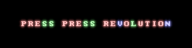

# 
A rhythm game where you need to use your whole keyboard to play

Gameplay inspired by [osu!](https://osu.ppy.sh), [Beatmania](https://en.wikipedia.org/wiki/Beatmania) and [Dance Dance Revolution](https://en.wikipedia.org/wiki/Dance_Dance_Revolution)

Visuals inspired by [Cogmind](https://store.steampowered.com/app/722730/Cogmind)

## Screenshots
<details>
 <summary>hinkik - Time Leaper</summary>
 
 
</details>

<details>
 <summary>LeaF - Aleph-0</summary>
 
 
</details>


## How to play
### Install levels
Unpack levels in `game's folder/levels` to play them

(Temporary) Download levels in the [Discord server](https://discord.gg/AuYUVs5)

### Gameplay
Press the corresponding buttons when they hit a white line at the bottom

There are also **hold notes** (`│`) that you should **hold** instead of just pressing

The blue arrows on the left indicate the speed changes and can be ignored

When you hit the note when it's perfectly on the line (or near it, depending on the current BPM), you get a **perfect hit** and 10 **score** points,
 when you hit it right before or after it has passed the line, you get a **hit** and 5 **score** points,
 when you hit it too early or don't hit it at all, you get a **miss** and you break your **combo** *(the combo counter resets to 0)*

When you hit, you get 1 combo point, the score you get gets multiplied by yor new combo
and you gain some amount of **health** (depends on the level)

When you miss, you lose some amount of **health** (depends on the level)

When your **health** hits 0, you fail

Your **health** is indicated with a red bar at the top of your screen

**Perfect combo** (PF for short) means that you only have **perfect hits** (you've hit all the notes perfectly)

**Full combo** (FC for short) means that you didn't hit all the notes perfectly but you didn't **miss** any

### Statistics
The stuff below the line is your **statistics**

The "SCORE" line shows your current amount of **score** points

The "ACCURACY" line displays your current **accuracy** in percentage *(the ratio of your **perfect hits**, **hits** and **misses**)*

The "COMBO" line displays your current **combo** and if you have **perfect** or **full** combo

The numbers on the **green**, **yellow** and **red** backgrounds are your current amount of **perfect hits**, **hits** and **misses** respectively

## How to create levels
1. To begin creating a level go to `game's folder/levels`
2. Put your music in that folder (supported formats: `ogg`, `wav` and `flac`)
3. Rename the music to whatever you'd want your level to be called
4. Create a new text (`.txt`) file with the same name and open it
5. Specify the difficulties you want to create for your level separated by new lines in the following format: `Difficulty name:Level author`, if you don't specify the author, the game will use the default author (you can edit it in the template (`levels/_template`) level by replacing `<unknown>` there), save the file
6. Open the game and press "EDIT" (or go to the main menu and go back to the editor level select menu, if you already were there)
7. Select your new level and the difficulty you'd want to edit, now you can begin editing your level

If you want to add more difficulties to your level than you originally created, repeat steps 4-7

If you want to rename the difficulty or change it's author, use the following format: `Old difficulty name:New author:New difficulty name`
(you can also only rename or only change the author: `Old difficulty name::New difficulty name`, `Difficulty name:New author`)

Example text file:
```
Very easy:coolDUDE420
Easy:anotherguy
Medium:YEP
Hard
Very hard omg noscope 360 pro:ConfiG
```

*You can publish your levels in the Discord server linked above*

### Editor controls
- `Mouse Wheel Scroll` - scroll the time

- `Page Up/Down` - scroll the time by 10 offset

- `Drag the progress bar line at the top` - scroll the time with your mouse

- `Any English letter`, `any number` or `-`, `=`, `[`, `]`, `;`, `'`, `,`, `.`, `/` - place a corresponding note on the line or selection
(`+ Shift` - place a hold note, `+ Alt` - remove only this note on the line or selection)

- `Backspace` - remove all the notes on the line or selection

- `Up/down arrows` - increase/decrease the speed by 10 BPM (`+ Shift` - 1 BPM) (`+ Alt` - increase/decrease the guide lines spacing)

- `Hold left mouse button` - select

- `Ctrl + C` - copy selection

- `Ctrl + X` - cut selection

- `Ctrl + V` - paste selection

#### *In case you want to use the keyboard instead of the UI buttons*
- `Left/right arrows` - decrease/increase the health drain *(the value which will be subtracted from the **health** on **misses**)* (`+ Shift` - restorage (the opposite of drain))

- `F1/F2` - increase/decrease the initial music offset by 1 ms (`+ Shift` - 10 ms)

### Creator guidelines
Note: These are just guidelines and you don't _have_ to follow them but it's recommended

#### Use multiplications of the current BPM
For example, if the *perfect* BPM at the current place is 120, then make it 240, 360, 480 etc.
to make this place fit the speed of the song and (sometimes) make it easier to read

#### Use the keyboard "lines" for (at least obviously) different parts and keys/"positions" for the current note (or just draw pars that seem to fit to the current place)
##### Lines

For example, if the current part of the song/level is going on the ASDF line and then the instrument changes, 
the line should change too (for example too QWER)

There are 4 lines in total you can use (1234, QWER, ASDF and ZXCV)

##### Notes

Use the keyboard keys to show the *relation* of the current note to the next note, 
a specific key doesn't always have to be one exact note

That means that if the next note is higher than the current note, then put the next in-game note one key to the right 
(for example if the current note is 'g', then the next note will be 'h')

Or if the next note is higher than just higher than the current note, place the in-game note two or three or how much 
keys you think it's relevant in the current situation

Same goes for lower notes but place them to the left

#### Leave some space before putting the first note
Give the players time to prepare and see what they need to press, usually about 1-3 seconds is enough

If the song starts right away you can start the map at the next part of the song or the next after that or 
where you think it's relevant

#### Don't make the player press more than 2 keys at the same time
Because [keyboard ghosting](https://www.google.com/search?q=keyboard+ghosting)

## Custom fonts
### How to install custom fonts
Unpack the font folder in `game's folder/resources/fonts`

Open the game and go to `Settings -> Graphics -> Font`, click the buttons on the right to choose the font (usually it's 1: Font name, 2: Font size, 3: Font scale)

### How to create custom fonts
Make an image of any size (1 image pixel = 1 screen pixel) with the characters you want to have in your font, save it as font.png, create mappings.txt and put the character size (`width,height`) on the first line and a list of the characters you have in your font in the direction of left to right and top to bottom on the second without separating them

You can add multiple fonts in your font folder, to do that, create folders in your font folder and put fonts there

**Highly recommended font folder hierarchy:** `[font name]/[font size (can be multiple)]/[font scale (usually x1 and x2 is enough, but you may want to add x3 and/or x4 if your font is too small or if you want to)]`

*You can use the default included font as an example*

## Custom color schemes
### How to install custom color schemes
Unpack the font folder in `game's folder/resources/colors`

Open the game and go to `Settings -> Graphics -> Colors`, click the buttons on the right to choose the color scheme

### How to create custom color schemes
The same as fonts but there's only one file in a folder (`colors.txt`), you can look for the default color schemes for an example

(`# some text` is a comment and is ignored by the game)

## Custom sounds
### How to install custom sounds
Unpack the font folder in `game's folder/resources/audio`

Open the game and go to `Settings -> Audio -> Sounds`, click the buttons on the right to choose the sound pack

### How to create custom sounds
The same as fonts but there are only audio files in a folder, you can copy the default sound pack and use it as a template
